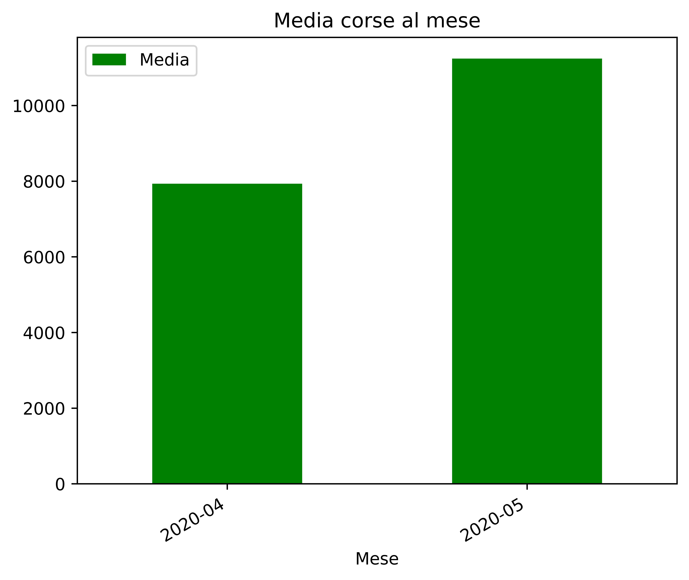
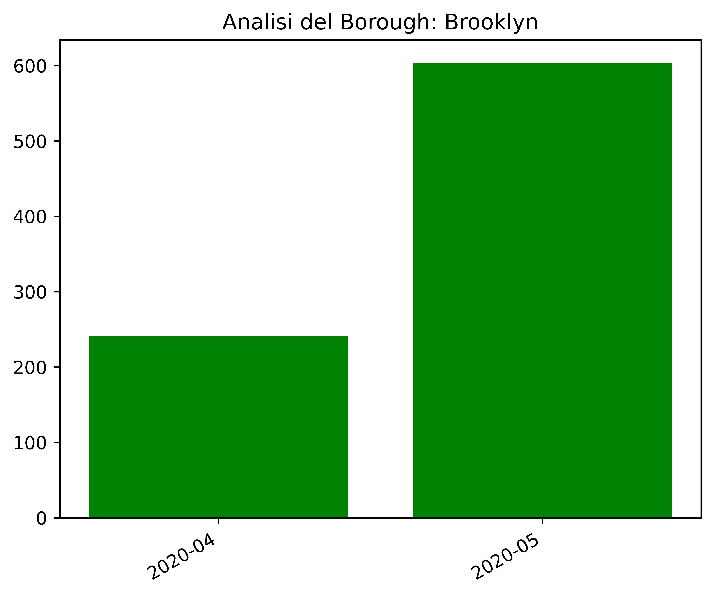

# Studio della frequenza dei viaggi dei taxi a NY

Questo programma fornisce uno studio sulla frequenza con la quale i taxi vengono utilizzati a NY. In particolare, restituisce il periodo in cui vengono adoperati più di frequente e quello in cui vengono utilizzati meno. 
L’analisi dell’attività può essere utile ai tassisti per pianificare i loro spostamenti in città, e al tempo stesso, può rappresentare per i clienti una linea guida sulla convenienza o meno dell’utilizzo di questo servizio. 

Per lo svolgimento di quest’analisi utilizziamo i dati pubblici delle rotte dei Taxi a NYC disponibili su https://www1.nyc.gov/site/tlc/about/tlc-trip-record-data.page. 


## Svolgimento dell’analisi

#### Download dei dati

Per svolgere l’analisi è necessario effettuare il download dei dati da analizzare. In particolare, ci soffermiamo sul dataset di Yellow Taxi Trip Records (CSV) 2022 (https://www.nyc.gov/site/tlc/about/tlc-trip-record-data.page).
I dati vengono quindi inseriti in un dataframe in ambiente Spyder. 

#### Analisi preliminare

Durante un’analisi preliminare del dataset, il dataframe viene filtrato per considerare solo le series che contengono i dati di nostro interesse. In particolare, ci soffermiamo sulla parte relativa alle date di partenza/arrivo dei taxi e ai rispettivi borough in cui vengono adoperati, a ognuno dei quali viene associato un codice identificativo (locationID). Inoltre, gli stessi set relativi alle date di partenza dei taxi, vengono filtrati, eliminando l’orario di prelievo del cliente, poiché superfluo ai fini dell’analisi. 


#### Input

Nella fase di input viene richiesto il periodo/i di cui si vuole effettuare l’analisi, che devono essere forniti secondo il formato anno-mese e intervallati da spazi (es. 2022-01 2022-02), e l’identificativo del/i borough da considerare (che viene assegnato secondo la legenda presente nel testo della richiesta di input), anch’essi inseriti intervallati da spazi (es. 0 1 2).

```
Quali mesi vuoi analizzare? (formato input: anno-mese, diviso da spazi): 2020-04 2020-05
```
```
Quali borough vuoi analizzare?
 -0 Bronx
 -1 Brooklyn
 -2 EWR
 -3 Manhattan
 -4 Queens
 -5 Staten Island
 -6 Unknown
 Inserire il valore corrispondente al borough da analizzare: 1 
 ```
 
#### Analisi dei dati

Nella parte relativa all’analisi dei dati, i datasets vengono ulteriormente filtrati, per eliminare i dati non validi e i valori NaN che potrebbero portare l’analisi ad un risultato errato.
In seguito, viene valutato il periodo di maggiore e minore frequenza di utilizzo dei taxi, attraverso il confronto della media delle corse relative ad ogni mese. 
Viene quindi calcolata la media aritmetica delle corse del mese in esame sui giorni dell’intero mese, e viene ripetuta la stessa analisi considerando la media mensile per ogni borough fornito nella fase di input. 

#### Ouput

Il prodotto dell’analisi dei dataset è facilmente interpretabile attraverso lo studio dei grafici che vengono forniti in output. In particolare, viene restituito un istogramma che mostra la media aritmetica per ogni mese considerato, e la media per ogni borough.
Inoltre, il risultato dell’analisi viene fornito attraverso una stringa che restituisce il mese, fra quelli in esame, che ha riscontrato la media di viaggi mensile maggiore, e quello che invece ha riscontrato la media minore.

Esempio:





#### Considerazioni Finali dell'Analisi
Inoltre abbiamo aggiunto la possibilità di avere in output dei file pdf con un minimo di visione complessiva dei dati.
Dall'analisi che abbiamo potuto effettuare ci siamo resi conto che prima dell'avvento del lockdown nel mese di marzo 2020 l'andamento annuale più o meno rispettava le stesse caratteristiche. 

La considerazione che abbiamo potuto fare a questo seguito che durante l'arco di mesi tra Febbraio - Aprile ci si ritrova il picco delle corse, invece durante l'intervallo tra il mese di Luglio-Agosto-Settembre si trova la mensilità con una media giornaliera di meno corso.

Per quanto abbiamo potuto notare applicando l'analisi anche hai singoli Borough che la maggior parte delle corse si svolgono all'interno del Borough di Manhattan avvengo la maggior parte di corse annuali anche medie di corse giornaliere supreiori alle 400000.

Come potevamo immaginare il Borough con meno corse si è rilevato essere Staten Island, e subito sopra troviamo EWR.

Si può gia vedere dal menù al momento dell'esecuzione del codice la presenza del Borough Unknown che sono delle corse che arrivano in alcuni strade ancora non appartenenti a un Borough.

Questa media di corse comunque non era tralasciabile, in quanto il valore si aggira attorno a un 6000 corse mensili. 

